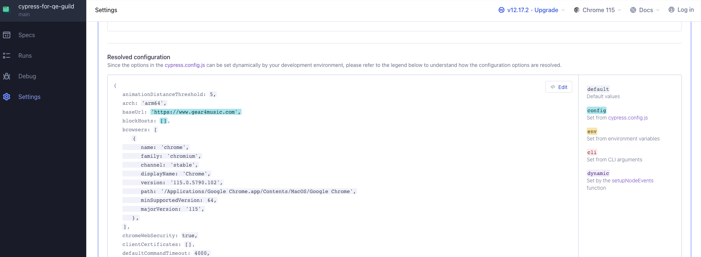

# cypress-for-qe-guild
A public repo that I created to demonstrate Cypress for E2E testing to the Gear4music QE Community.

## Install the project dependencies:
```
npm install
```

## Open the Cypress Application:
This will open up the Cypress Application and a wizard will appear to create the folder structure of a basic Cypress project for you.  
You will also be given an option to add a demo test suite to your project too.  
You don't have to let Cypress add these files, I personally prefer to create them myself but it's worth letting Cypress do it's thing if you're still new to test automation.   
```
npx cypress open
```

## Running the tests the old fasioned way:
The below command will execute the tests in a terminal window like we're used to.  
I assume this is how Cypress will be executed in a CI/CD workflow.  
```
npx cypress run --browser=chrome --spec=./cypress/e2e/examples/pages.cy.js
```

## Basic Cypress Project Structure:
```
cypress >
	downloads >
		downloaded files will go here by default
	e2e >
		This is the default location for your tests/specs
	fixtures >
		data files go in here
		customer address details
		test emails/password
		test card details
		JSON responses to simulate an API response
	pages/page-objects >
		This is where your page objects live
	screenshots >
		Same as above. If a test fails, a screenshot will be taken
	support >
		'support' is the default name, but we can rename this as long as we let Cypress know in the config file.
		common actions/utilities that are used in lots of tests
		If you need to override Cypress config for certain tests/suites, this can also live here (global before/after hooks)
	videos >
		When running tests in terminal, video records will exist here
	cypress.config.js
		This is your cypress config file that holds info such as:
		"Where are the tests?" 
		"Where are screenshots saved?"
		"What screen resolution to use?"
		"What browser(s) to use?"
		"What's the base URL etc."
```


## Values I personally change in the Cypress Config file:
By default, this file will be empty as all the default values are used.  
In the Cypress Application, click 'Settings' > 'Project settings' and scroll down to 'Resolved configuration'.  
I personally copy all these values and place them inside `cypress.config.js` so they're more visible.  


An example of what my `cypress.config.js` looks like:
```
const { defineConfig } = require("cypress");

module.exports = defineConfig({
  e2e: {
    animationDistanceThreshold: 5,
    arch: 'arm64',
    baseUrl: 'https://www.gear4music.com',
    blockHosts: [],
    browsers: [...]
	 ...
  }
};
```

The values I personally change from their default values are the below:  
### watchForFileChanges:
This will tell Cypress to execute the test everytime you make a change to a given file and save it. I prefer to set this to `false` so I can execute the test when I want.  
  
### baseUrl:
I set this to the homepage of the application under test, so I can just provide the end of the url path in my `cy.visit()` commands.  
  
### testIsolation:
Snowballing tests or having tests reliant on others is an anti-pattern. This is set to `true` by default, as expected, but I set this to `false` so any global `before/after` hooks I configure in the `support` folder aren't triggered for EVERY single `it`. Even though this is set to `false` you should still always write your tests so they can run in any order and they're not reliant on the previous ones passing!  

```
{
   baseUrl: 'https://www.example.com',
	testIsolation: false,
	watchForFileChanges: false,
};
```
	

## Talking About Tests:
Cypress test files are still known as `specs` but their file extensions are *.cy.js by default.
They can also end in .jsx, .ts and .tsx too.

By default, they will live in the `cypress/e2e/*` folder but you can override this location your config file.
`specPattern: 'cypress/e2e/**/*.cy.{js,jsx,ts,tsx}'`

## Probably the biggest 'gotcha' with Cypress:
[You can read about Cypress best practices here](https://docs.cypress.io/guides/references/best-practices)

```
// This does not work the way you think it does.
// You can't assign or work with the return valeus of any Cypress command.
const button = cy.get("#add-to-basket");
button.click();
```

You can do this by:
```
cy.get("#add-to-basket").then((button) => {
	button.click();
});
```

Or use it as an Alias:
```
// Alias are good to improve readability of your code.
cy.get("#some-really-long-css-selector").as("addToBasketButton");
cy.get("@addToBasketButton").click();
```

## Assertions:

[You can read the official docs on Cypress Assertions here](https://docs.cypress.io/guides/references/assertions)

### SHOULD:
```
	cy.url().should("include", "Fender")
		.should("not.include", "av.com")
		.should("eq", "https://www.gear4music.com/Manufacturer/Fender.html");

	cy.get("[data-test='desktop/plp/category-box']").should("exist")
		.should("be.visible");
```

### AND:
```
	cy.url().should("include", "Fender")
		.and("not.include", "av.com")
		.and("eq", "https://www.gear4music.com/Manufacturer/Fender.html");

	cy.get("[data-test='desktop/plp/category-box']").should("exist")
		.and("be.visible");
```

### EXPECT:
```
	cy.url().then((currentUrl) => {
		expect(currentUrl).to.include("Fender");
		expect(currentUrl).to.not.include("av.com");
		expect(currentUrl).to.eql("https://www.gear4music.com/Manufacturer/Fender.html");
	});

	cy.get("[data-test='desktop/plp/category-box']").then((element) => {
		expect(element).to.exist;
		expect(element).to.be.visible;
	});
```